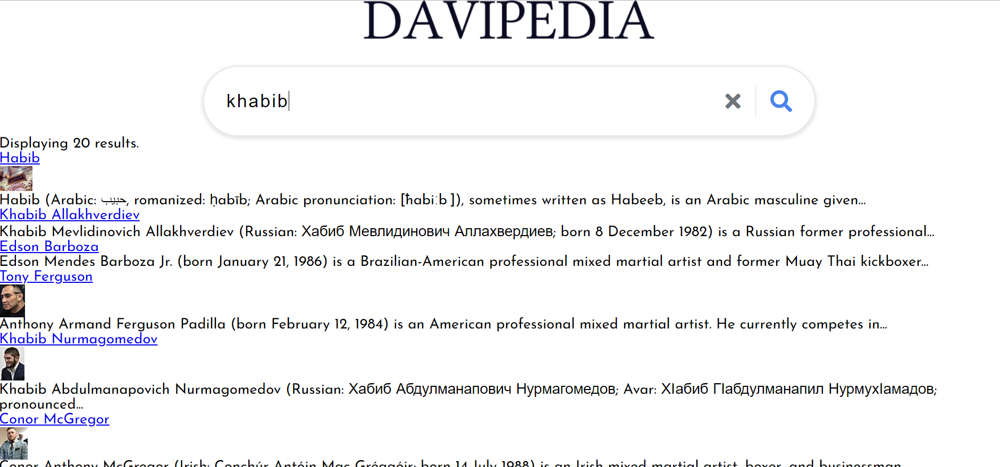
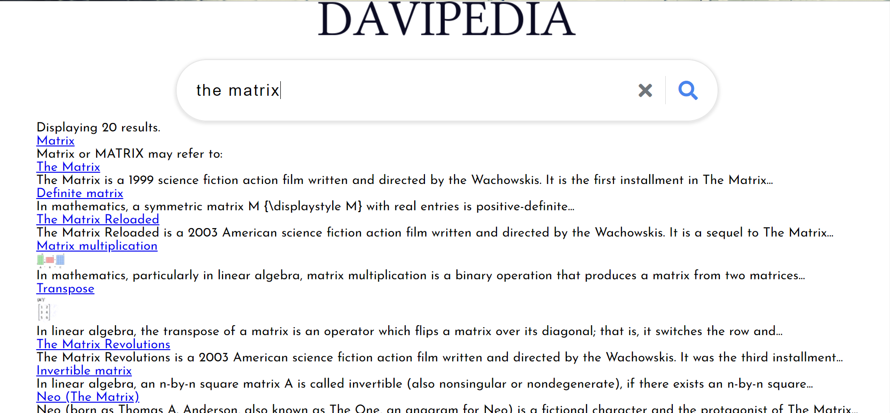

# davipedia

This is search site. I fashioned it to look like Wikipedia site using the Wikipedia API. I've always been curious about the Wiki API and I wanted to use it. Plus I wanted more experience making API calls and I wanted to use modules to import and export files.

# Environment Setup

1. Clone my repo at https://github.com/davidmstanleyjr/davipedia
2. CD into it from your terminal and open it in VS Code.
3. Click "run in browser" so you can see the actual site.

# Technologies Used

1. HTML
2. SCSS
3. Javascript
4. Wikipedia API
5. Javascript Modules
6. Fontawesome

# Issues

Working with the modules was a bit confusing. I've imported and exported files using React and Svelte before but i've never done that with vanilla Javascript. Getting functions to work in other files was hard because I had to import and export them, well as call them within the correct function. It's not something that I'm accustomed to doing and I had to get more comfortable with it.

# Screenshots

# Live Page

Here is a link to the deployed site.
https://davidmstanleyjr.github.io/bootleg-google/
